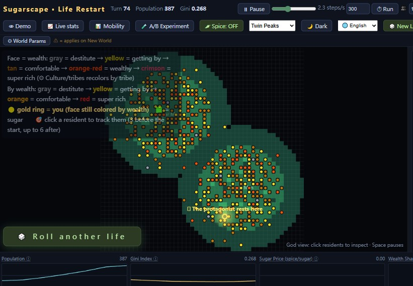

# 🍬 Sugarscape: Life Restart

> **Where you are born looks random — until you live it.**
> Based on the sociology experiment that has been running in computers since 1996.
> Press play: nobody manages this world — and the wealth gap grows all by itself.

**A social experiment game in a single HTML file**: zero dependencies, no install, just open it in a browser.

🎮 **Play now**: download `sugarscape.html` and open it with any modern browser.

**English** | [中文](README.zh-CN.md) | [繁體中文](README.zh-TW.md) · Manuals: [English](docs/manual/en.md) · [中文](docs/manual/zh.md) · [繁體中文](docs/manual/zhtw.md) · [日本語](docs/manual/ja.md) · [Français](docs/manual/fr.md) · [Deutsch](docs/manual/de.md) · [Italiano](docs/manual/it.md)

---

## What is this?

In 1996, Epstein & Axtell ran the famous **Sugarscape** experiment:
a map with sugar mountains, and agents that only know "walk toward the food you can see". No storyline, no designer —
and yet **wealth gaps, class segregation and market prices all emerged on their own**.

This project turns that experiment into a game **where you get reincarnated into the world yourself**:

- 🎲 **Birth is a lottery** — birthplace, talent, lifespan and starting food are all drawn. You may open your eyes on a sugar mountain, or at the starving edge of the wasteland.
- 🚶 **Live it yourself** — click cells to walk, harvest, trade with neighbors, save up for school (+1 vision, see farther).
- 💀 **Death report** — highlights and limits of your life, how many turns you outlived the AI autopilot, and what happened to the world while you lived.
- 📚 **Book of Lives** — every life is recorded; click any row to replay its summary.
- 👻 **Possession** — after death, jump into any living agent and see how the rich and the poor actually live.

**Birth sets the difficulty, not the ending.** Come and test that sentence yourself.

## For serious players (experiment tools)

| Tool | What you can observe |
|---|---|
| 📈 Live stats | Gini index, poverty rate, poor→middle climb rate, rich share — big live readouts with interpretation |
| 📊 Mobility tracking | poor/middle/rich birth cohorts painted as rings on the map; watch who climbs the mountain; climb/hold/fall matrix |
| 🧪 A/B experiment | a lottery-talent world vs an identical-talent world, racing 300 turns, verdict computed automatically |
| ⚙ World parameters | redistribution tax, schooling price, tribal war, crowd plague, three terrain modes, pure-sugar world… every knob is an experiment |
| ⏱ Timed run | run N turns non-stop; the world goes on even if you die |
| 👁 Demo mode | auto-plays lives with event captions — perfect for showing an audience |

## i18n

The UI ships in **Chinese / English / 日本語 / Français / Deutsch / Italiano** — fully translated, including birth reports, death summaries, logs and panels.
The language dropdown (🌐) switches instantly; on first open it follows your browser language, and your choice is remembered.

## Running

- Any modern browser (Chrome / Edge / Firefox / Safari). No plugins, no network needed.
- Progress is saved in your browser (localStorage); clearing it wipes your Book of Lives.

## Files

| File | What it is |
|---|---|
| `sugarscape.html` | The game (single file, zero dependencies) |
| `docs/manual/` | Full experiment manual in 6 languages |
| `docs/images/` | Screenshots |

## Self-check

Open `sugarscape.html?test=1` to run 30 assertions (win-win trades, NaN defense, ecological stability, inheritance, terrain constraints…).
The chronicle's first entry should read `30/30 passed ✅`.

## 📺 Video walkthrough

What does the experiment actually look like while it runs? A narrated, screen-recorded walkthrough is on YouTube — every number in the video comes from a real run, not hand-waving:

- **YouTube**: search "Sugarscape Life Restart" (direct link will be added here once published)

## Copyright

- This is an **independent implementation** of the *ideas* of the Sugarscape experiment (ideas are not copyrightable); it is not affiliated with Epstein & Axtell's original work or any commercial implementation, and uses none of their code.
- Code released under the [MIT License](LICENSE): free to use, modify and redistribute — please keep the copyright notice.
- Share it with teachers, students, and anyone curious about social science.
